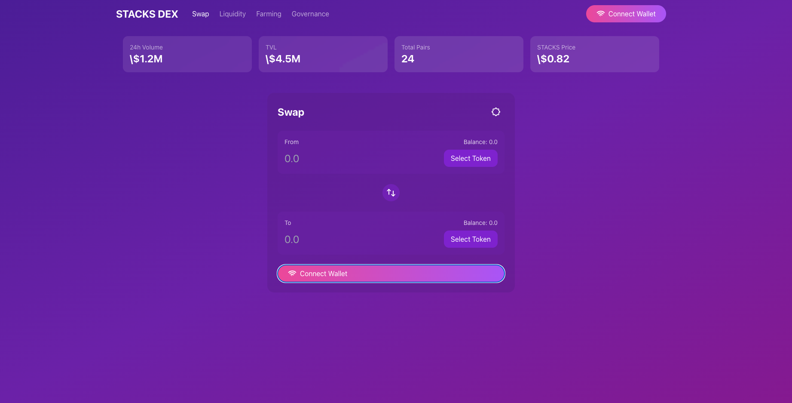

# STACKS DEX

## Description

STACKS DEX is a decentralized exchange platform built on the Stacks network. It allows users to exchange tokens securely and without intermediaries. The project aims to offer an intuitive user interface and advanced features such as swapping, liquidity provision, farming, and governance.

## Features

- **Swap**: Swap tokens instantly with low fees.
- **Liquidity**: Add liquidity to earn rewards.
- **Farming**: Participate in farming pools to maximize your returns.
- **Governance**: Take part in the platform's decisions via a decentralized voting system.

[def]: https://file%2B.vscode-resource.vscode-cdn.net/Users/jojo/Library/Mobile%20Documents/com~apple~CloudDocs/projets%20web3/16-STACKS/stacks-dex/dex-stacks/images/dex-stacks.png?version%3D1732620938362